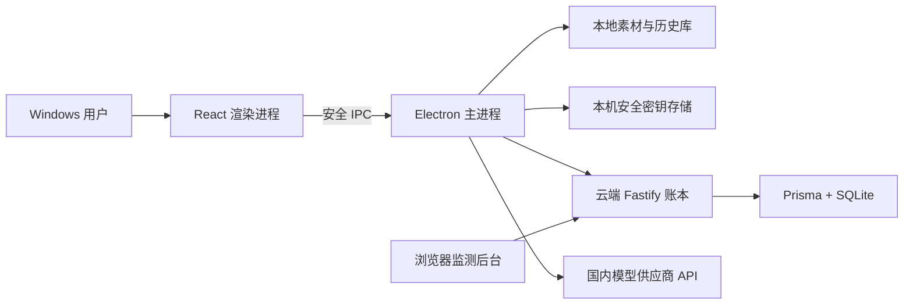
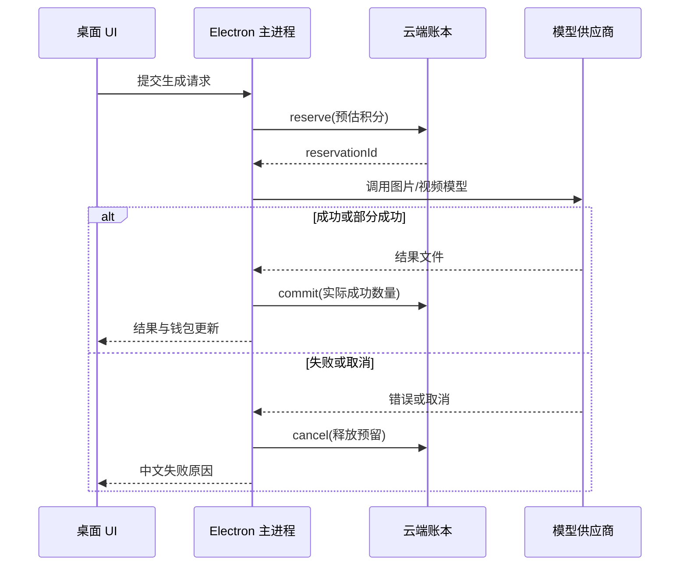

# 系统架构

最后更新：2026-07-01

## 总览

轻拍采用“Windows 桌面工作流 + 云端中心账本 + 第三方模型供应商”的结构。

## 桌面端

### 渲染进程

`src/renderer/` 负责界面和工作流，包括图片/视频生成、上传、批量任务、历史、回收站、个人图库、图片对比、画布编辑、设置和更新公告。渲染进程不直接访问文件系统、数据库或凭据。

### 主进程

`src/main/` 是桌面端可信边界，负责：

- 文件选择、素材导入、导出和本地媒体协议。
- 本地 sql.js 数据库、历史、回收站、图库和画布项目。
- API Key 安全存储与状态查询。
- 图片和视频供应商适配器调用。
- 云端账号、钱包和用量 API 调用。
- 通过预加载脚本暴露类型化 IPC。

`src/shared/` 保存 IPC 名称、公共类型、供应商配置、模型目录、计价规则、预设和更新公告。

### 本地数据

用户图片、生成结果、视频、历史、图库和画布项目保存在 Electron 用户数据目录。生成素材使用受限的 `product-shot-media://` 协议展示，避免渲染进程任意读取本机文件。

供应商 API Key 只保存在本机安全存储。云端会话令牌和本机已用账号摘要保存在 Electron 用户数据目录，不提交 Git。

## 模型适配层

统一适配器位于 `src/main/providers/`。当前图片供应商为：

- 阿里百炼：Qwen Image/Edit。
- 火山方舟：Doubao Seedream 3.0/4.0/5.0。
- 腾讯混元：Hunyuan Image/Rapid。

视频模型目录包含通义万相、豆包 Seedance 和腾讯云点播聚合模型。模型 ID 在共享配置中维护，UI 不应硬编码供应商请求格式。

生成请求由预设提示词、产品描述、风格要求、比例、质量和输出数量组成。提示词必须强调保持产品形状、Logo、颜色、材质和比例，仅改变背景、布光、构图、景深和陈列环境。

## 云端后端

`server/` 使用 Fastify + TypeScript + Prisma。Nginx 终止 HTTPS 并反向代理到只监听回环地址的 Node 服务。

后端职责：

- 注册、登录、会话和在线心跳。
- 唯一账号 ID、可重复账号名和账号状态。
- 钱包余额、预留积分、充值与使用流水。
- 生成任务摘要、失败原因和审计事件。
- 管理员监测页面和管理 API。

密码使用带盐哈希存储，不保存可恢复的明文密码。管理员可以重置密码，但不能读取原密码。

## 数据模型

Prisma 模型位于 `server/prisma/schema.prisma`：

- `User`：账号 ID、显示账号名、密码哈希、状态和登录/在线时间。
- `Wallet`：可用积分、预留积分、累计充值和累计使用。
- `WalletTransaction`：充值、扣费和管理员调整流水。
- `GenerationJob`：媒体类型、供应商、模型、状态、费用和错误。
- `UsageReservation`：生成前积分预留及其提交/取消状态。
- `AuditEvent`：登录、后台操作和异常请求审计。

当前数据库为 SQLite。迁移 PostgreSQL/MySQL 时应通过 Prisma 迁移完成，不能直接修改生产表。

## 生成与计费数据流

当前模型调用发生在桌面端，`reserve/commit/cancel` 仍依赖客户端正确执行。正式商业计费前，应把模型调用和最终扣费迁到后端同一可信流程。

## 环境切换

默认后端地址为 `https://api.qingpaiai.com`。只有显式设置本地后端地址并使用 `npm.cmd run dev:local` 时，桌面端才会启动并连接隔离的本地账本。开发库和云端生产库不共享数据。
